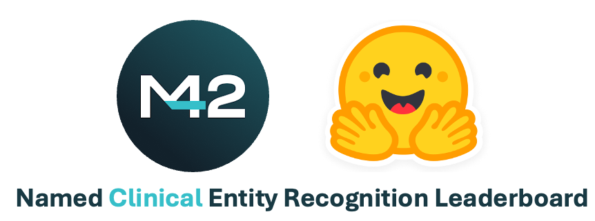

<h1 align="center">NCER | Clinical NER Benchmark</h1>

<!-- <p align="center">
    <a href="https://github.com/embeddings-benchmark/mteb/releases">
        
    </a>
    <a href="https://arxiv.org/abs/2210.07316">
        
    </a>
    <a href="https://github.com/embeddings-benchmark/mteb/blob/master/LICENSE">
        
    </a>
    <a href="https://pepy.tech/project/mteb">
        
    </a>
</p> -->

<h4 align="center">
    <p>
        <a href="#installation">Installation</a> |
        <a href="#usage">Usage</a> |
        <a href="https://huggingface.co/spaces/m42-health/clinical_ner_leaderboard">Leaderboard</a> |
        <a href="#documentation">Documentation</a> |
        <a href="#citing">Citing</a>
    <p>
</h4>

<h3 align="center">
    <a href="https://huggingface.co/spaces/m42-health/clinical_ner_leaderboard"></a>
</h3>


## Installation

```bash
git clone https://github.com/WadoodAbdul/clinical_ner_benchmark.git
cd clinical_ner_benchmark
pip install -e .
```

## Usage


```python
from clinical_ner.models import SpanExtractor
from clinical_ner.evaluation import Evaluator
from clinical_ner.benchmarks import NCER

model_name = "alvaroalon2/biobert_diseases_ner"

benchmark = NCER 

# the below config is model and dataset specific. This should contain config for all datasets in the loaded benchmark
dataset_wise_config = {
        "NCBI": {"label_normalization_map": {"DISEASE": "condition"}}
    }
# load a predefined model (or for a custom implementation see https://github.com/WadoodAbdul/clinical_ner_benchmark/blob/master/docs/custom_model_implementation.md)
model = SpanExtractor.from_predefined(model_name)

evaluator = Evaluator(model, benchmark=benchmark, dataset_wise_config=dataset_wise_config)
evaluation.run()
```


<br /> 

<details>
  <summary> Advanced Usage (click to unfold) </summary>


## Advanced Usage


### Using a custom model

Models should be inherited from the `GenericSpanExtractor` or `SpanExtractor` abstract classes.

```python
from clinical_ner.models import GenericSpanExtractor
from clinical_ner.models.span_dataclasses import NERSpans

class MyCustomModel(GenericSpanExtractor):
    def extract_spans_from_chunk(text: str, **kwargs) -> NERSpans:
        """
        Extracts spans from sequences of any length

        Args:
            text: The text from which spans should be extracted.
            **kwargs: Additional arguments to pass to the encoder.

        Returns:
            The NERSpans.
        """
        pass


model = MyModel()
benchmark = NCER 

# the below config is model and dataset specific.
dataset_wise_config = {
        "dataset_name": {"label_normalization_map": {"DISEASE": "condition"}}
    }
evaluator = Evaluator(model, benchmark=benchmark, dataset_wise_config=dataset_wise_config)
evaluation.run()
```
More information on custom implementation can be found [here](docs/custom_model_implementation.md)


</details>

<br /> 

## Documentation

| Documentation                  |                        |
| ------------------------------ | ---------------------- |
| 📋 [Datasets] | Overview of available Datasets |
| 📋 [Metrics] | Overview of available Metrics |
| 📈 [Leaderboard] | The interactive leaderboard of the benchmark |
| 🤖 [Submit to leaderboard] | Information related to how to submit a model to the leaderboard |
| 👩‍🔬 [Reproducing results] | Information related to how to reproduce the results on the leaderboard |
| 👩‍💻 [Custom model implementation] | How to add a custom model to run the evaluation pipeline | 

[Datasets]: docs/datasets.md
[Metrics]: docs/metrics.md
[Submit to leaderboard]: docs/submit_to_leaderboard.md
[Leaderboard]: https://huggingface.co/spaces/m42-health/clinical_ner_leaderboard
[Reproducing results]: docs/reproducing_results.md
[Custom model implementation]: docs/custom_model_implementation.md

## Citing


```bibtex
@misc{abdul2024namedclinicalentityrecognition,
      title={Named Clinical Entity Recognition Benchmark}, 
      author={Wadood M Abdul and Marco AF Pimentel and Muhammad Umar Salman and Tathagata Raha and Clément Christophe and Praveen K Kanithi and Nasir Hayat and Ronnie Rajan and Shadab Khan},
      year={2024},
      eprint={2410.05046},
      archivePrefix={arXiv},
      primaryClass={cs.CL},
      url={
https://arxiv.org/abs/2410.05046}, 
}
```

